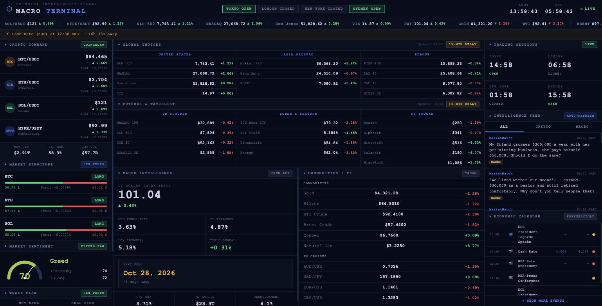

# CoinDiva Macro Terminal

A single-screen macroeconomic and crypto intelligence terminal. Aggregates 20+ live data feeds across traditional finance and digital assets into one Bloomberg-style dashboard, built to answer one question at a glance: **what is the macro backdrop doing to risk assets right now?**



Built and maintained by **Beth Silverberg** ([@CoinDiva](https://github.com/CoinDiva)).

---

## Why this exists

Macro context drives crypto, but the data is scattered across a dozen sites: FRED for rates, Yahoo for indices and commodities, CoinGecko for spot, exchange APIs for derivatives positioning, ForexFactory for the calendar. Checking them one by one is slow and you miss the cross-asset picture entirely.

This pulls all of it into one screen that refreshes every 60 seconds.

---

## What it shows

| Panel | Data | Source |
|---|---|---|
| Crypto Command | BTC, ETH, SOL, HYPE spot + funding rates | CoinGecko |
| Market Structure | Long/short ratio, funding, positioning | OKX perps |
| Market Sentiment | Crypto Fear & Greed index | Alternative.me |
| Global Indices | S&P 500, NASDAQ, Dow, VIX, Nikkei, Hang Seng, KOSPI, FTSE, DAX, CAC, STOXX | Yahoo Finance |
| Futures & Watchlist | US futures, bonds, sectors, single names | Yahoo Finance |
| Macro Intelligence | DXY, Fed Funds, 2Y/10Y Treasury, yield spread, CPI, M2, unemployment | FRED API |
| Commodities + FX | Gold, Silver, WTI, Brent, Copper, NatGas, major FX crosses | Yahoo Finance |
| Trading Sessions | Live Tokyo / London / New York / Sydney clocks | Local |
| Intelligence Feed | Categorized macro + crypto headlines | RSS / Reuters |
| Economic Calendar | Upcoming releases with forecast vs. prior | ForexFactory |
| FOMC Countdown | Days to next Fed decision | Public Fed calendar |

---

## Architecture

```
Browser (MacroTerminal.html)
    |
    |  all cross-origin calls go through the local proxy
    v
server.py  (Python stdlib only, port 8765)
    |
    +-- /config.js    injects API keys from secrets.json at runtime
    +-- /yahoo        batched, thread-pooled quote fetch
    +-- /coingecko    spot prices
    +-- /okx /binance /bybit   derivatives + funding
    +-- /news /coindesk        RSS aggregation
    +-- /relay        allowlisted CORS relay for FRED, calendar, RSS fallbacks
    +-- /reuters      Reuters Connect (see Known Issues)
    v
Upstream APIs
```

**Why a local proxy at all?** Browsers block cross-origin requests to most of these APIs, and several rate-limit aggressively per-client. Routing through `server.py` solves CORS, lets requests fan out across a thread pool instead of running serially, and keeps API keys out of client-side source.

**Design constraints:**
- Zero dependencies. Python standard library only, no `pip install`, no build step.
- Single HTML file. No framework, no bundler.
- Graceful degradation. Every feed has a fallback chain, and a dead feed renders a visible `DOWN` state rather than a blank panel.

---

## Setup

```bash
git clone https://github.com/CoinDiva/macro-terminal.git
cd macro-terminal

cp secrets.example.json secrets.json
# add your FRED key: free at https://fredaccount.stlouisfed.org/apikeys

python3 server.py
```

Then open <http://localhost:8765/MacroTerminal.html>

Requires Python 3.8+. Nothing else.

> Opening `MacroTerminal.html` directly as a `file://` URL will not work. The page depends on the proxy for keys and CORS.

---

## Engineering notes

**Silent failure is worse than loud failure.** In July 2026 the terminal's original quote source (Stooq) began returning empty responses for every symbol. Because the fetch layer swallowed errors in bare `catch {}` blocks, four panels rendered blank rather than erroring: commodities, FX, US indices, and European indices. The dashboard looked like it was loading forever.

Two changes came out of that:

1. **Single source of truth for quotes.** All 22 symbols now route through one batched Yahoo Finance call, fanned out server-side across a thread pool. Cold load dropped from ~25s (serial, rate-limited) to ~2-3s.
2. **Failures are now visible.** Feed health is tracked in `FEED_STATUS`, dead panels render a red `DOWN` row, and the server logs `Yahoo → MISSING: <symbols>` naming the exact tickers that failed. A partial batch returns partial results instead of throwing away the symbols that succeeded.

**Caching.** Quotes cache to `localStorage` on a 2-minute TTL, macro series on 24 hours since FRED data is monthly. `getCachedNonEmpty` guards against a partially-populated cache masking a broken feed: a lesson learned when a stale `{DXY}`-only cache entry made a perfectly healthy FX feed look dead.

---

**Own the dependency, or it owns you.** In September 2026 every FRED field and the economic calendar went blank at once. Correlating by source again pointed away from the display: both relied on a free public CORS relay as a fallback, and that relay had switched to paid-only access. The fix was a small allowlisted `/relay` route inside `server.py`, which removed the third-party dependency entirely. The relay only forwards to named hosts and logs every refused or failed request.

---

## Known issues

- **Reuters Connect returns 403** on every auth format tried. Suspected OAuth2 client_secret requirement. News currently falls back to RSS.
- **DXY has an approximation fallback.** If Yahoo's `DX-Y.NYB` fails, DXY is derived from EUR/USD and flagged `derived: true`. It is an estimate, not the real index.
- Index and futures data carry a 15-minute delay, as labeled in the UI.

---

## Files

| File | Purpose |
|---|---|
| `MacroTerminal.html` | Dashboard: markup, styles, and full data layer |
| `server.py` | Local proxy and static file server |
| `secrets.example.json` | Template for API keys |
| `START MACRO TERMINAL.command` | macOS double-click launcher |

---

## License

Personal project. Not investment advice. Data is provided by third parties on an as-is basis and may be delayed or wrong.
